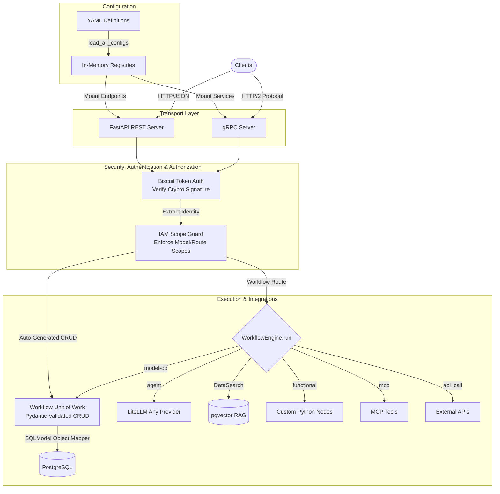

<p align="center">
  &nbsp;&nbsp;<span style="font-size:2em"><strong>tuvl</strong></span><br/>
  <sub>/ˈtuːvəl/ &nbsp;·&nbsp; തൂവൽ &nbsp;·&nbsp; feather</sub>
</p>

<p align="center">
  YAML-driven workflow orchestration engine — compose pipelines of functional nodes,<br/>
  LLM calls, API integrations, and MCP tools, served as a REST API<br/>
  with Postgres persistence and Redis-backed state.
</p>

<p align="center">
  <a href="https://tuvl.io">Website</a> &nbsp;·&nbsp;
  <a href="https://tuvl.dev">Docs</a> &nbsp;·&nbsp;
  <a href="https://github.com/tuvl-io/public">GitHub</a>
</p>

> **Hey there!** 👋 The source code is on its way — we're tidying things up before the public release. Keep an eye on this repo and star it so you don't miss the drop.

`tuvl` lets you define, run, and manage multi-step AI workflows using plain YAML files. No boilerplate. No complex overhead. No lock-in.

Install `tuvl[standard]` during development to get **Tuvl Insight** — a full browser-based developer portal for designing models, configuring datasources, managing LLM providers, building workflows visually, controlling access, and testing execution — all without leaving your local environment.

- **Website:** [tuvl.io](https://tuvl.io)
- **GitHub:** [tuvl-io/public](https://github.com/tuvl-io/public)

---

## 🏛️ Architecture & Data Flow



---

## 📦 Installation

### Core (production server)

```bash
pip install tuvl
# or
uv add tuvl
```

Installs the full workflow engine and REST API server. Sufficient for all production deployments.

### With Tuvl Insight (developer portal)

```bash
pip install "tuvl[standard]"
# or
uv add "tuvl[standard]"
```

Adds **Tuvl Insight** — a full browser-based developer portal, active only when `TUVL_DEV_MODE=true`. See the [Tuvl Insight](#-tuvl-insight-developer-portal) section for the full feature list.

### CLI (global tool)

```bash
uv tool install tuvl
```

### SDKs

> **Coming soon** — SDKs are being prepared for release alongside the source code.

| SDK | Package | Status |
|-----|---------|--------|
| Python | `pip install tuvl-sdk` / `uv add tuvl-sdk` | Coming soon |
| JavaScript / TypeScript | `npm install @tuvl/client` | Beta — [`@tuvl/client`](https://www.npmjs.com/package/@tuvl/client) |

The SDKs provide typed clients for triggering workflows, subscribing to execution events via SSE, and managing workflow instances from your own applications.

---

## 🚀 Quick Start

**1. Scaffold a new project:**

```bash
# Create a new folder named 'my-project' in the current directory
tuvl init my-project

# Create it inside a specific parent directory
tuvl init my-project --project-dir /path/to/workspace

# Initialise an already-named path (project name inferred from last component)
tuvl init --project-dir /path/to/workspace/my-project
```

`tuvl init` always creates the target directory (it will not overwrite an existing one). Prompts for Postgres and LLM provider credentials and writes a `pyproject.toml` + `.env`.

**2. Install dependencies:**

```bash
uv sync
```

Installs `tuvl` and any project-level packages into a local `.venv`. Add extra packages with `uv add <package>` — useful when your nodes use libraries like `pandas` or `httpx`.

**3. Start the development server:**

```bash
uv run tuvl dev
```

Starts the engine with hot reload on `http://localhost:8000`. If `tuvl[standard]` is installed, the Insight dashboard is available at `http://localhost:8000/insight`.

**4. Run in production:**

```bash
tuvl run --project-dir /path/to/project --workers 4
```

Starts the production uvicorn server without hot reload.

---

## 🗂️ Project Structure

A tuvl project directory contains:

```
my-project/
├── pyproject.toml        # Project deps — add extras with: uv add <pkg>
├── .env                  # LLM API keys and database config (git-ignored)
├── .env.example          # Safe-to-commit template
├── config.yaml           # Directory layout (customisable)
├── models/               # Data model definitions (YAML)
├── datasources/          # Datasource definitions (YAML)
├── llms/                 # LLM / AgentModel configs (YAML)
├── nodes/                # Custom Python node implementations
└── workflows/            # Workflow definitions (YAML)
```

Share a project by committing everything except `.env` — collaborators run `uv sync` to reproduce the exact environment.

---

## ⚙️ CLI Reference

| Command | Description |
|---|---|
| `tuvl init <name>` | Create `<name>/` in the current directory and scaffold inside it |
| `tuvl init <name> --project-dir <parent>` | Create `<parent>/<name>/` and scaffold inside it |
| `tuvl init --project-dir <path>` | Scaffold into `<path>/` (project name inferred from last component) |
| `tuvl init <name> --sample` | Same as above, plus sample recruitment pipeline covering every step kind |
| `tuvl init <name> --multi-tenant` | Scaffold in **multi-tenant** mode — locks `deployment_mode: multi_tenant` in `.tuvl/system.yaml`, injects `tenant_id` columns into every model, and enables Postgres Row-Level Security tooling |
| `tuvl dev` | Start the engine in dev mode with hot reload. The dev key is written to `.tuvl/.dev-session` (mode 0600); pass `--show-key` to print it, and `--auto-login` to automatically bypass the Insight security screen |
| `tuvl run` | Start the production server |
| `tuvl test` | Run LLM-as-a-Judge tests against workflow definitions. In multi-tenant projects, automatically injects a synthetic tenant so the data-layer guard doesn't reject test runs |
| `tuvl validate` | Validate workflow and model YAML files |
| `tuvl db generate-rls` | Emit `ALTER TABLE … ENABLE ROW LEVEL SECURITY` + tenant-scoped policy SQL for every tenant-aware model (multi-tenant only) |
| `tuvl db check-rls` | Verify that RLS is enabled and policies are present on every tenant-aware table |
| `tuvl stream-watch` | Tail workflow execution events from the engine's SSE stream |
| `tuvl help` | Show all commands |

### Common options

```bash
tuvl dev --port 9000 --project-dir ./my-project
tuvl dev --show-key                  # print the dev API key (off by default)
tuvl dev --auto-login                # automatically bypass the Tuvl Insight security screen
tuvl run --host 0.0.0.0 --port 8000 --workers 2
tuvl run --allow-host 10.0.0.0/8     # IP allowlist
tuvl validate --project-dir ./my-project
```

---

## 🔩 Workflow Step Kinds

Workflows are YAML files defining a sequence of steps. Each step has a `kind`:

| Kind | Description |
|---|---|
| `functional` | Execute a registered Python node function |
| `agent` | Call an LLM (via litellm) with a prompt template, read context keys, write output back to context |
| `api_call` | Make an outbound HTTP request and map the response into context |
| `mcp` | Call a tool via the Model Context Protocol (stdio or SSE) |
| `router` | Evaluate a condition and branch to a named route |
| `model-op` | Perform CRUD operations on a registered data model |
| `response` | Shape and return the final HTTP response from context keys |

---

## 🧰 Makefile Targets

For development within the monorepo:

```bash
make setup        # Install core dependencies
make setup-all    # Install core + Tuvl Insight + dev tools
make dev-ui       # Run server + Insight dashboard (TUVL_DEV_MODE=true)
make dev-core     # Run server in dev mode without UI
make build-ui     # Compile React SPA into tuvl-insight wheel
make build        # Build both tuvl and tuvl-insight wheels → dist/
make publish      # build → publish both wheels to PyPI (set UV_PUBLISH_TOKEN)
make lint         # Run ruff
make fmt          # Run black
make check        # Run ruff + black + mypy
make clean        # Remove build artifacts
```

---

## 🔬 Tuvl Insight (Developer Portal)

Installed via `pip install "tuvl[standard]"`. Active only when `TUVL_DEV_MODE=true`.

Tuvl Insight is not just an observability tool — it is a complete **local developer portal** that covers the full development lifecycle of a tuvl project.

### Design & Configuration

| Section | Description |
|---|---|
| **Workflows** | Visual YAML editor with a live graph view of step connections, routes, and node types. Create, edit, and save workflow definitions without touching files directly. |
| **Models** | Form-driven model designer — define fields, types (PostgreSQL-native and extended), primary keys, relationships, and constraints. Generates YAML automatically. |
| **Datasources** | Configure Postgres datasource connections (host, port, database, credentials) with a structured form. |
| **LLM Models** | Manage `AgentModel` definitions — select from preset providers (OpenAI, Anthropic, Ollama, Groq, Gemini, LiteLLM proxy) or configure custom endpoints and API keys. |

### Access Control

| Section | Description |
|---|---|
| **IAM** | Create and manage users and roles. Assign and revoke role scopes. The role editor shows a live scope-suggestion palette — click any scope pill to add it to the role without typing. Scope strings are served by `GET /admin/scopes` and cover every CRUD model, workflow, and system scope registered in the engine. Full CRUD for the built-in identity and access management layer. |
| **Federation** | Configure OAuth2/OIDC federation providers (Google, GitHub, Microsoft, and custom). Manage client credentials and scopes. |

### Infrastructure & Reference

| Section | Description |
|---|---|
| **Settings** | Configure infrastructure components — Redis connection and other runtime settings. |
| **API Docs** | Embedded Swagger UI and ReDoc viewer for the live tuvl REST API, including all dynamically-generated workflow and model endpoints. |

### Execution Testing

| Feature | Where | Description |
|---|---|---|
| **Tuvl Lens** | Spectrum page (`/insight`) | Execute a single workflow node in isolation with mock state — unit-test individual steps without running a full workflow |
| **Tuvl Spectrum** | Spectrum page (`/insight`) | Run a complete workflow and capture a deep-copy state snapshot after every step — full execution trace with per-step timing |
| **Workflow Canvas Test Mode** | Workflow editor toolbar | Run any workflow directly from the canvas with a custom JSON input. Results stream live: nodes light up with status badges, the right-hand **Test Out** panel shows a step-by-step context diff, and a bottom status bar tracks overall progress |
| **Portal UI** | `GET /insight` | Browser interface to the full developer portal |

#### Workflow Canvas Test Mode — at a glance

1. Open a workflow in the editor and click **▶ Test** in the toolbar.
2. Fill the input JSON — required fields are auto-scaffolded from the workflow's `input_schema`.
3. Click **▶ Run**. The canvas switches automatically to test mode:
   - Each node shows a live status badge (⏳ running, ✓ success, ✗ error).
   - The **Test Out** panel opens on the right, streaming step results as they arrive.
   - Click any step to inspect the before/after context diff with Logs and Error sub-tabs.
   - The **Final State** entry shows every key in the terminal context.
4. A status bar at the bottom of the canvas shows overall result and a one-click **View Output** shortcut.

---

## �️ Security & Multi-Tenancy

tuvl ships **single-tenant by default** and **multi-tenant by opt-in**. Both modes share the same auth, observability, and hardening primitives.

### Authentication & Identity

- **Biscuit tokens** — cryptographically attenuable bearer tokens with offline verification. The engine fails closed in production if no signing key is configured.
- **Dev sentinel** — a fixed sentinel keypair is used only when `TUVL_DEV_MODE=true`; production startup refuses to boot with the sentinel active.
- **User identity propagation** — `current_user_id` is bound from the verified Biscuit `principal()` fact and attached to every log line and OpenTelemetry span.
- **Token revocation** — a Redis-backed blacklist supports immediate revocation; the UI revokes any prior session token before storing a new one on login.

### Multi-Tenant Mode (`tuvl init --multi-tenant`)

| Layer | Guarantee |
|---|---|
| **Tenant binding** | `tenant()` fact extracted from the Biscuit at verification time → pushed into `current_tenant_id` contextvar (sync + async + gRPC) |
| **Fail-closed boundary** | `MissingTenantContextError` raised at the data-access layer when the contextvar is unset — never silently leaks across tenants |
| **Postgres RLS** | `tuvl db generate-rls` emits per-model policies keyed on `app.current_tenant_id`; a SQLAlchemy `after_begin` hook issues `SET LOCAL app.current_tenant_id` for every session |
| **Defence in depth** | Raw-SQL paths (RAG, search) guard the tenant filter at the query builder; `tuvl db check-rls` is a CI-friendly verifier |
| **Cross-version safety** | Versioned model tables use a composite key including `tenant_id` to prevent cross-tenant collisions on shared sequences |

Embed the engine in your own host application via the public `tuvl.tenancy` module:

```python
from tuvl.tenancy import tenant_scope

with tenant_scope("acme-corp"):
    await engine.run_workflow("onboard_candidate", payload)
```

### Hardening Defaults

- **CRUD endpoint scope enforcement** — every auto-generated model route (`/models/{model}/…`) enforces a Biscuit `scope()` fact. Default names are `{modelname.lower()}:read`, `{modelname.lower()}:write`, `{modelname.lower()}:delete`; override per model with `spec.access` in the `ModelDefinition` YAML. Tokens carrying `iam:admin` satisfy every scope check.
- **Secrets file modes** — `.tuvl/.dev-session` and `.env` are created with mode `0600` so other accounts on shared hosts can't read them.
- **Dev key handling** — never echoed to the terminal by default (`tuvl dev --show-key` opts in); always persisted owner-only.
- **UI session storage** — the dev portal stores the bearer key in `sessionStorage` (tab-scoped) with a 15-minute idle expiry watchdog.
- **Markdown rendering** — `rehype-sanitize` is applied to every `ReactMarkdown` mount to neutralise XSS in user-controlled prompt output.
- **Env-driven UI config** — REST and gRPC base URLs come from `VITE_API_BASE` / `VITE_GRPC_BASE`; the Vite dev proxy honours `VITE_API_TARGET` for remote engine connections.
- **Verbose error logging** — gated behind `import.meta.env.DEV` so production bundles don't leak structured RPC errors to the console.
- **Allowlists** — `tuvl run --allow-host` accepts IP and CIDR ranges; localhost is always permitted.
- **Pooling & limits** — connection pool sizing is configurable; a shared HTTP client is reused across API-call steps.

### Observability

- Structured JSON logs via `structlog` with `tenant_id`, `user_id`, `workflow`, `step_id`, and `run_id` on every record.
- OpenTelemetry spans cover HTTP requests, workflow executions, individual steps, LLM calls, and database transactions — see [docs/observability.md](docs/observability.md).
- HITL (human-in-the-loop) state machine emits dedicated events for pause, resume, and timeout transitions.

---


MIT — see [LICENSE](LICENSE).
